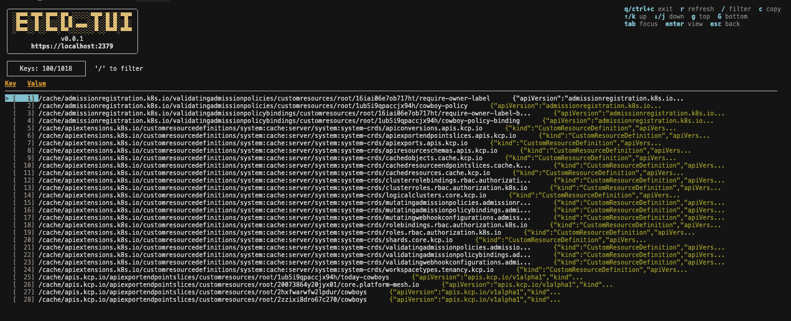

# etcd-tui

A modern terminal interface for interacting with your etcd database. Navigate keys, view values, filter data, and manage your etcd cluster directly from your terminal.



## Features

- Connect to etcd (with optional TLS support)
- Browse keys in etcd with a table view
- View values for selected keys with JSON formatting
- Filter/search keys and values
- Navigate with keyboard shortcuts
- Configuration file support
- Copy values to clipboard
- Pagination support for large datasets

## Installation

### From Releases (Recommended)

Download the latest release for your platform from the [Releases](https://github.com/olamilekan000/etcd-tui/releases) page.

**Linux:**
```bash
# AMD64
wget https://github.com/olamilekan000/etcd-tui/releases/latest/download/etcd-tui_linux_amd64.tar.gz
tar -xzf etcd-tui_linux_amd64.tar.gz
chmod +x etcd-tui
sudo mv etcd-tui /usr/local/bin/

# ARM64
wget https://github.com/olamilekan000/etcd-tui/releases/latest/download/etcd-tui_linux_arm64.tar.gz
tar -xzf etcd-tui_linux_arm64.tar.gz
chmod +x etcd-tui
sudo mv etcd-tui /usr/local/bin/
```

**macOS:**
```bash
# Intel
wget https://github.com/olamilekan000/etcd-tui/releases/latest/download/etcd-tui_darwin_amd64.tar.gz
tar -xzf etcd-tui_darwin_amd64.tar.gz
chmod +x etcd-tui
sudo mv etcd-tui /usr/local/bin/

# Apple Silicon
wget https://github.com/olamilekan000/etcd-tui/releases/latest/download/etcd-tui_darwin_arm64.tar.gz
tar -xzf etcd-tui_darwin_arm64.tar.gz
chmod +x etcd-tui
sudo mv etcd-tui /usr/local/bin/
```

**Windows:**
Download `etcd-tui_windows_amd64.zip` or `etcd-tui_windows_arm64.zip` from the releases page and extract the `etcd-tui.exe` file.

### From Source

**Prerequisites:**
- Go 1.24 or later
- etcd instance (TLS is optional)

**Build:**
```bash
git clone https://github.com/olamilekan000/etcd-tui.git
cd etcd-tui
go mod tidy
go build -o etcd-tui
```

## Configuration

etcd-tui supports configuration via a config file or environment variables. TLS is optional - if TLS credentials are not provided, etcd-tui will connect without TLS.

### Config File (Recommended)

Create a config file at `~/.etcd-tui/config.json`:

**Without TLS:**
```json
{
  "endpoints": "http://localhost:2379"
}
```

**With TLS:**
```json
{
  "endpoints": "https://localhost:2379",
  "ca_cert": "/path/to/ca/cert.pem",
  "key": "/path/to/client/key.pem",
  "cert": "/path/to/client/cert.pem"
}
```

You can also specify a custom config path:
```bash
etcd-tui -config /path/to/config.json
# or
etcd-tui -c /path/to/config.json
```

### Environment Variables

Alternatively, set environment variables:

**Without TLS:**
```bash
export ETCDCTL_ENDPOINTS=http://localhost:2379
```

**With TLS:**
```bash
export ETCDCTL_API=3
export ETCDCTL_ENDPOINTS=https://localhost:2379
export ETCDCTL_CACERT=/path/to/ca/cert.pem
export ETCDCTL_KEY=/path/to/client/key.pem
export ETCDCTL_CERT=/path/to/client/cert.pem
```

**Priority:** Config file (if specified) > Default config file (`~/.etcd-tui/config.json`) > Environment variables

## Usage

Run the application:
```bash
etcd-tui
```

Or with a custom config:
```bash
etcd-tui -config /path/to/config.json
```

## Keyboard Shortcuts

### Navigation
- `↑` / `k`: Move cursor up (or scroll up in value view)
- `↓` / `j`: Move cursor down (or scroll down in value view)
- `←` / `h`: Decrease split pane width
- `→` / `l`: Increase split pane width
- `g`: Jump to top (or top of value view)
- `G`: Jump to bottom (or bottom of value view)

### Actions
- `Enter`: View value for selected key (with JSON formatting)
- `/`: Activate filter mode
- `r`: Refresh keys list
- `Tab`: Switch between table and value view
- `c` / `y`: Copy selected value to clipboard
- `Esc`: Clear filter or close value view
- `q` / `Ctrl+C`: Quit

### Value View
- `↑` / `↓`: Scroll through long values
- `g`: Jump to top of value
- `G`: Jump to bottom of value
- `Esc`: Close value view

### Mouse
- Click on a row to select it
- Click and drag the separator to adjust split pane width
- Scroll in value view to navigate long values

### Building

```bash
go build -o etcd-tui
```

### Running Tests

```bash
go test ./...
```

### Contributing

Contributions are welcome! Please feel free to submit a Pull Request.

## License

MIT

